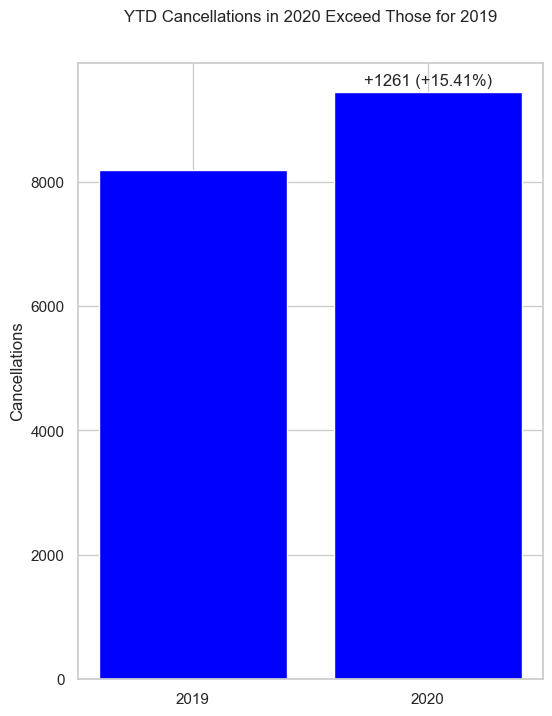
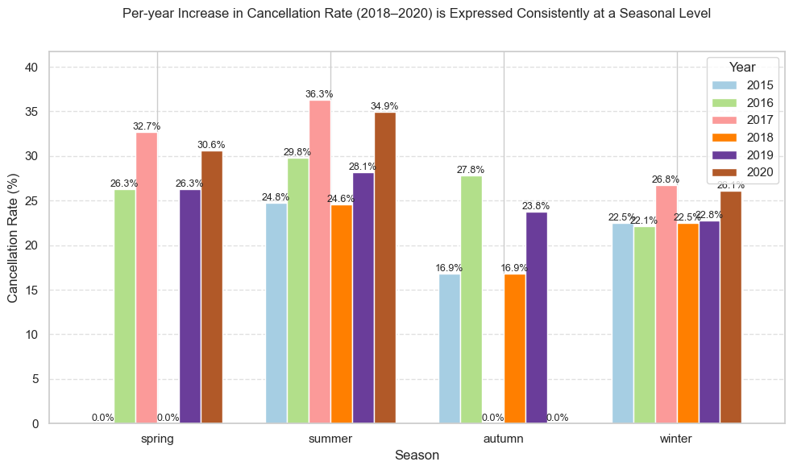

# Sources

Definitions and background:
https://www.sciencedirect.com/science/article/pii/S2352340918315191#s0005

Data 2018 - 2020:
https://absentdata.com/data-analysis/where-to-find-data/
Uploaded as "hotel_revenue_historical-full-2.csv"

Data 2015 - 2017:
https://github.com/rfordatascience/tidytuesday/blob/main/data/2020/2020-02-11/readme.md

# Brief

EDA to clean and process data to derive insights into cancellation rates

# Detail

## Trend

Rising Cancellations per Month and Cancellation Rate per Year 2018 - 2020:

YYD Cancellations in 2020 Exceed Those of 2019:

Whilst there are weak signs of certain seasonal effects influencing cancellation rates, 
overall we can diagnose a year-on-year issue with cancellation rates:

## Drivers

### Bookings with Lengthy Lead Times

... to be completed

