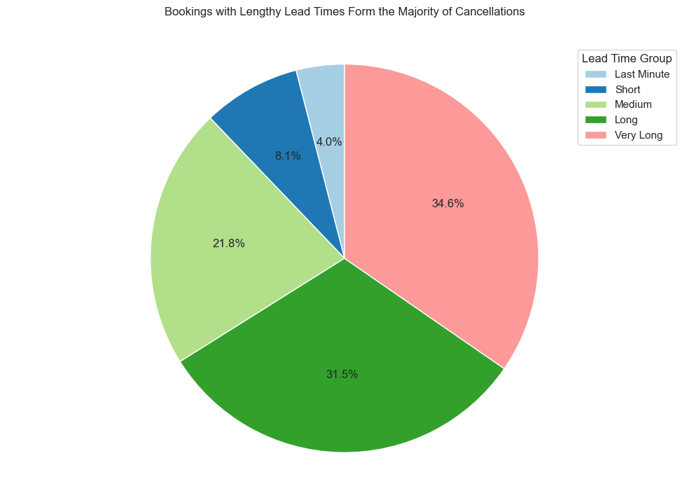
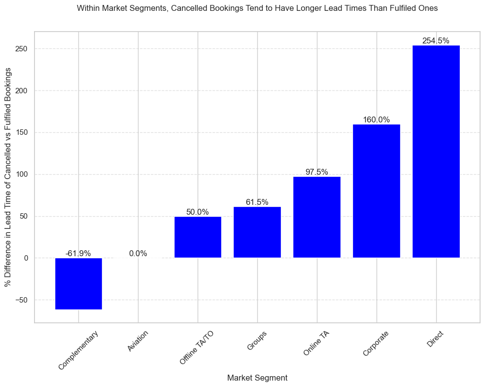
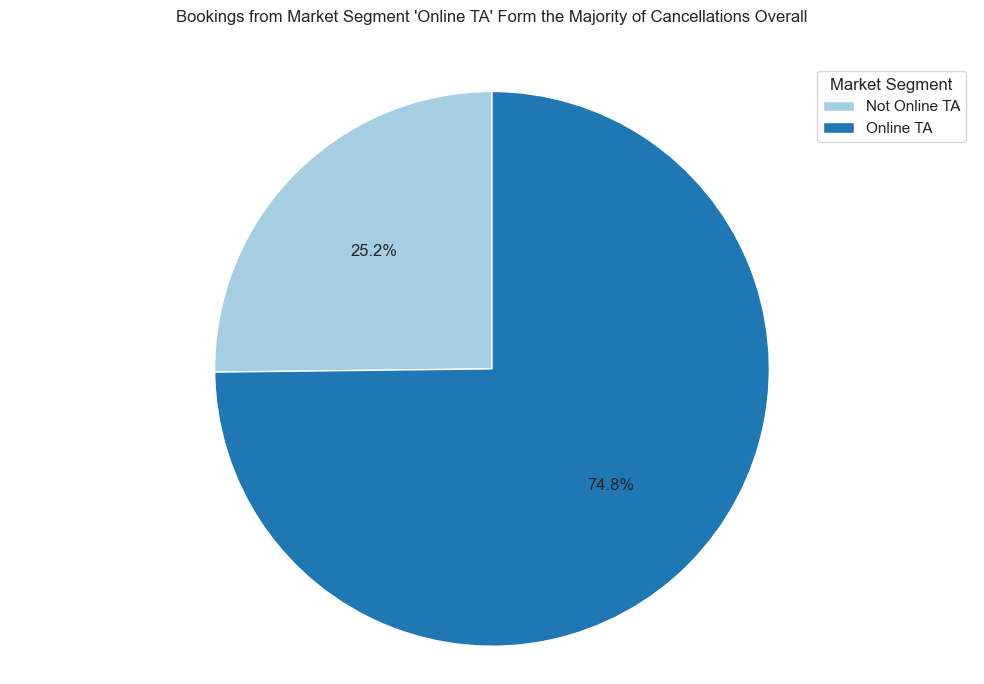
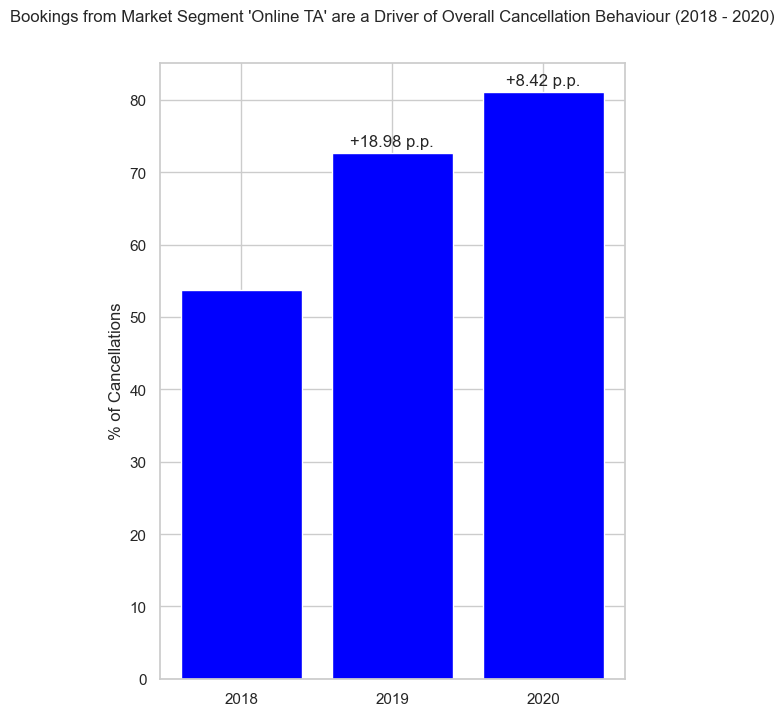
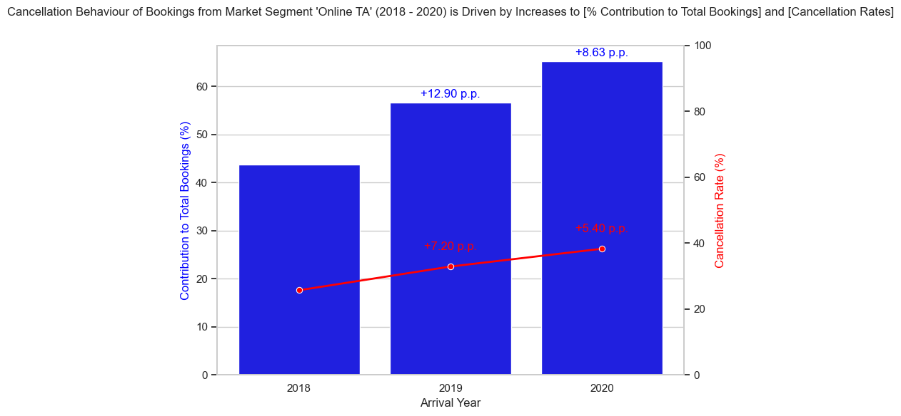

# Sources

Definitions and background:
https://www.sciencedirect.com/science/article/pii/S2352340918315191#s0005

Data 2018 - 2020:
https://absentdata.com/data-analysis/where-to-find-data/
Uploaded as "hotel_revenue_historical-full-2.csv"

Data 2015 - 2017:
https://github.com/rfordatascience/tidytuesday/blob/main/data/2020/2020-02-11/readme.md

# Brief

EDA to clean and process data to derive insights into cancellation rates, propose relevant actions in accordance.
This project therefore answers hypothetical business questions like:
- "Are there particular channels/groups/etc. with increasing cancellation trends which mitigation efforts should be focused on?"
- [To do: add revenue implications into analysis to add depth to above]
- "Why are our forecasting models for occupancy losing accuracy?

**Outline of findings:**

1) Cancellation volume and rate are rising 'recently' 2018 - 2020.
2) (1) is driven mostly by bookings from 'Online TA' segment and bookings with longer lead times: these types of bookings make up a large proportion of cancellations.
3) (2) is intensifying over time: in the time period of interest, these two booking types are making up an increasing proportion of per-year cancellations.
4) (3) is an outcome of these types of bookings being popular in general (make up a large proportion of overall bookings), and have relatively high cancellation rates. Furthermore, both these aspects (popularity, propensity to cancel) are increasing in the time period of interest (with slight exceptions).
5) We observe too that the average lead time of bookings from Online TA is itself increasing, so these are not isolated booking patterns: bookings are 'worsening' on two joint fronts.

**Recommendations derived:**

1) Overall, offering online channels and long lead-times is beneficial, as they are popular means of making bookings, and ultimately >50% of bookings from these sources are fulfiled, so it is worthwhile to stick to them. In other words, it would be backward-thinking and extreme to get rid of them. Instead, focus should be on mitigation/management, and calibrating forecasting models to be sensitive to these types of bookings.
2) Tame cancellation rate through e.g. locking-in of favourable prices conditional on non-refundability, being more aggresive with reminders to keep prospective bookings front of mind for customers (encourage customers to actually convert plans into completed trips), etc. Naturally, these are in concept applicable universally across all booking types, and indeed it is probably a good idea (reduce cancellation rates across all channels) - point is to enact these extra hard for the booking types on hand. E.g. especially generous early lock-in prices for Online TA. E.g. adjust schedule of automated reminers when lead time detected as extremely long.
3) Calibrate forecasting model for occupancy rates: if not already segmented on lead time and market segment, then do so. Also note that I myself engineered the lead time group categories, which may or may not help clear the picture / advise a more useful model. If the model was already segmented on these factors, then fine-tune accordingly.

# Detail

## Rising Cancellation Rate and Volume (per Period) 2018 - 2020:

Rising Cancellations per Month and Cancellation Rate per Year 2018 - 2020:

YYD Cancellations in 2020 Exceed Those of 2019:

Whilst there are weak signs of certain seasonal effects influencing cancellation rates, 
overall we can diagnose a year-on-year issue with cancellation rates independent of seasonal efects:

## Drivers of worrying cancellation behaviour

### Driver 1: Bookings with Lengthy Lead Times

The majority of cancellations overall are from bookings with longer lead times:

This is consistently true year by year / period by period, and is because of relatively higher booking volumes and cancellation rates from such bookings (no charts presented for these points).

Not only are bookings with lengthy lead times a major force for overall cancellations, but their influence is increasing, as their contribution to overall cancellation volumes increased 2018 - 2020:

The increased influence of bookings with long lead times as above is driven both by increases in bookings made with such lead times, and in the cancellation rate of such bookings:

**Reccomendations**
Consider that offering long booking lead times is a benefit to customers, seen in how they form the majority of bookings overall. So long as the offering of long lead-times brings in more successful than failed bookings, which is the case since cancellation rate < 50%, presenting them as an option / encouraging them is worthwhile.

The takeaways to be actioned are more around working around the cancellation tendencies of such bookings,
and trying to calm the rising trend therein, instead of discouraging the bookings entirely:
1) Calibrate overbooking strategy: use latest data on cancellation rate from these lead-time groups to make occupancy planning more robust
2) Likewise for revenue forecasting
3) Try reducing cancellation risk through e.g. slight discounts or lock-in prices or room upgrades for choosing non-refundable bookings, more aggressive reminders to confirm bookings, etc.

### Driver 2: Bookings from "Online TA" segment/channel

Market segments do have distinct effects on cancellation rate independent of lead time, seen in how certain segments have high cancellation rates but relatively low lead times, and vice versa (no visual provided).

However, it still must be acknowledged that lead time does affect within-segment cancellation rates as expected: longer --> higher cancellation likelihood:

Bookings from "Online TA" segment form the majority of overall cancellations:

This is consistently true year by year / period by period, and is because of relatively higher booking volumes and cancellation rates from such bookings (no charts presented for these points).

Not only are bookings from ONline TA segment a major force for overall cancellations, but their influence is increasing, as their contribution to overall cancellation volumes increased 2018 - 2020:

The increased influence of bookings with long lead times as above is driven both by increases in bookings made with such lead times, and in the cancellation rate of such bookings:

**Reccomendations**

The takeaways and insights for market segment analysis are quite similar to those of lead times, 
in that there is a prominent entity (online TA bookings, long lead-time bookings) which are rising in contribution to overall yearly cancellations, 
this itself a result of that entity increasing in contribution to overall yearly bookings, and having an increasing cancellation rate. 
Furthermore, they both represent 'modern' bookings perks which are attractive to customers (they are popular aspects of placing bookings), 
and as of now, more bookings are fulfiled than not, so in neither case is it adviseable to steer away from them by offering only short-notice, offline / online but not TA bookings.  

The action points for the business are therefore similar:
1) Encourage customers to take on non-cancellable bookings even if using Online TA by locking in slightly lower prices if non-refundable, for instance.
2) Drill down into which specific Online TA are most culpable and plan bespoke mitigation strategies
3) Factor in a rising cancellation rate trend into overbooking systems if they exist

## Interaction (long) lead time vs (Online TA) segment

We see that average lead times within the Online TA segment have increased in the same pattern cancellation rates (within this segment and overall) changed over time, suggesting the former as an explanation for the latter.

To do: build chart for above and make recommendations/implications more specific if possible given this is the case.

