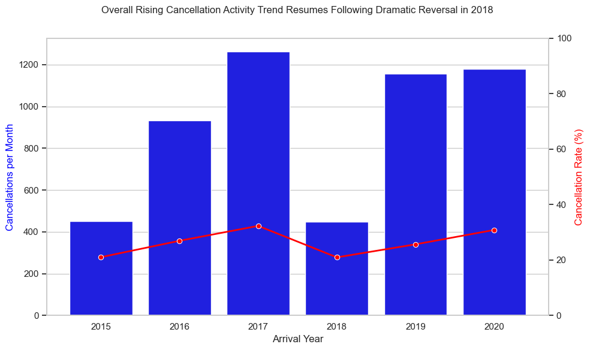
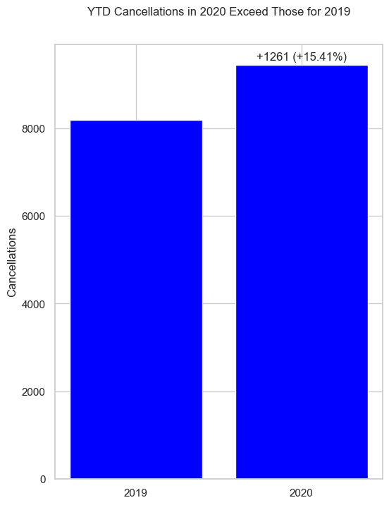
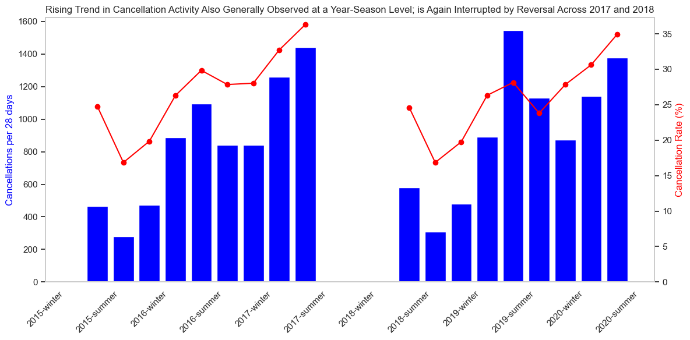
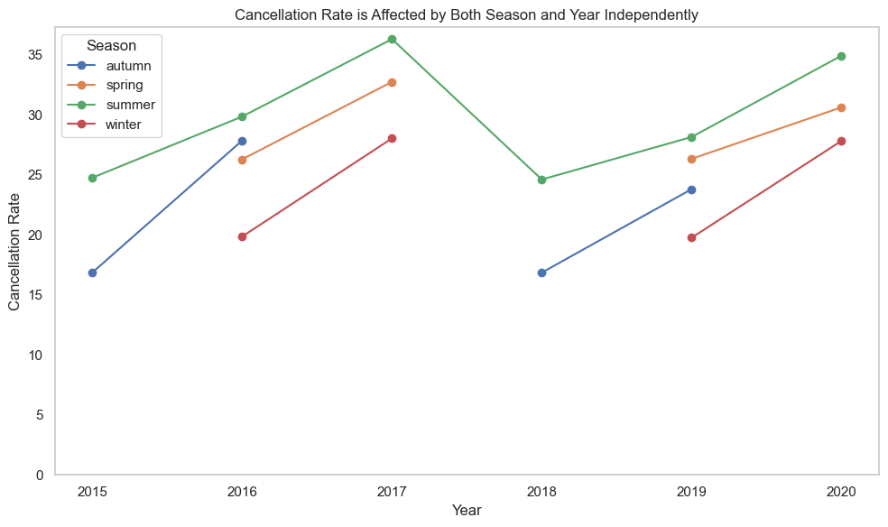
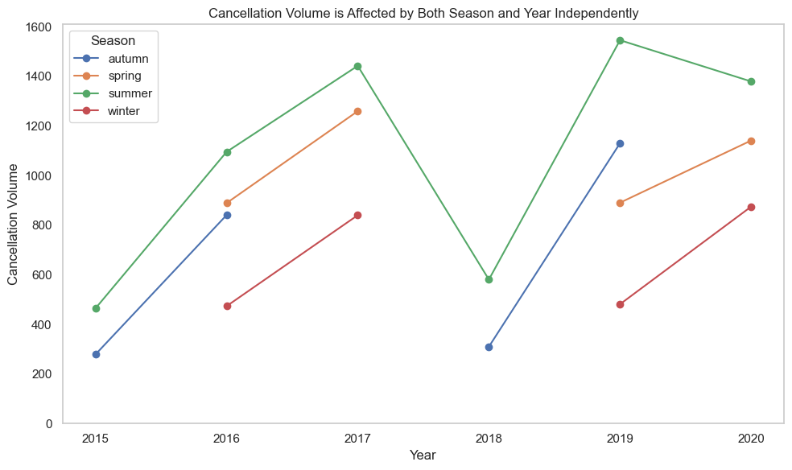
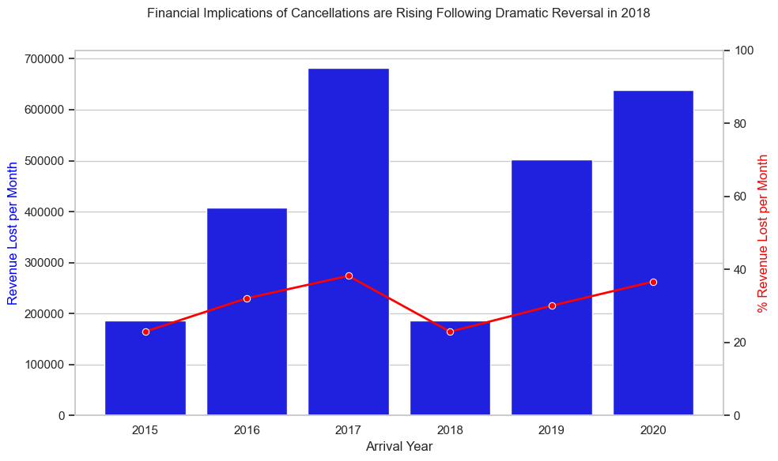
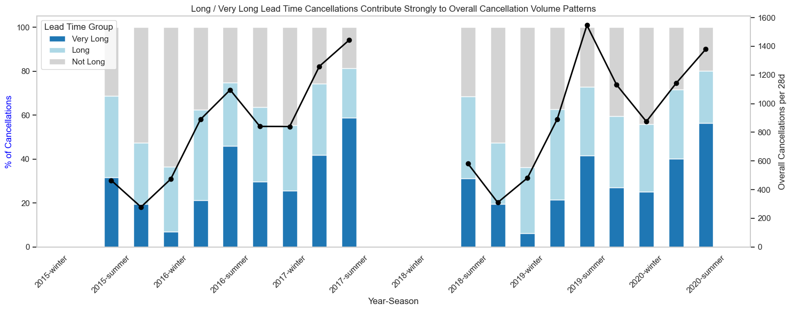
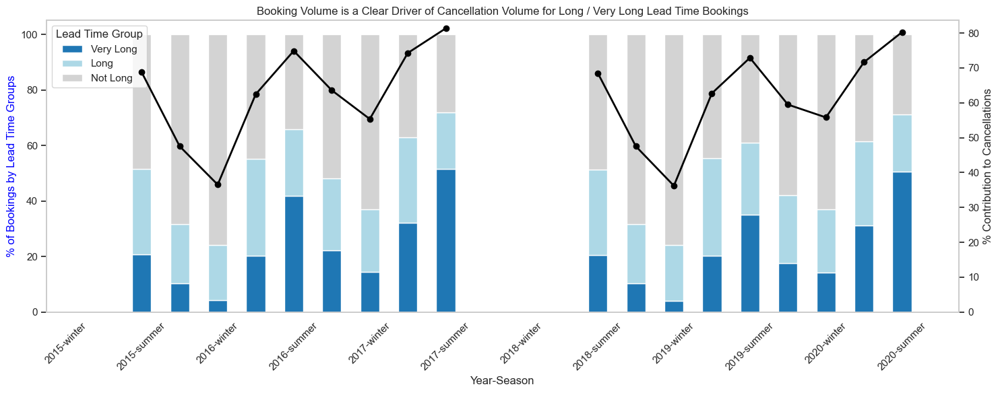
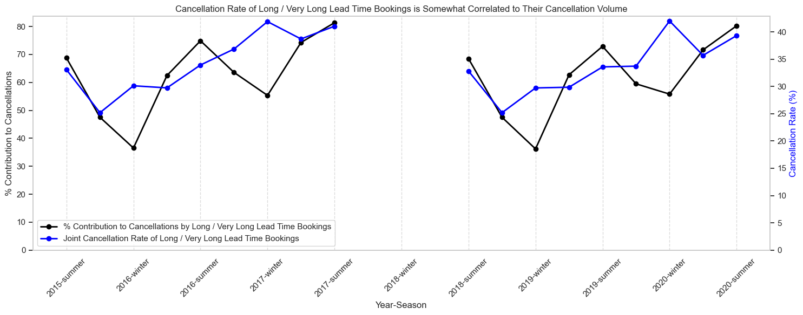

# Sources

Definitions and background:
https://www.sciencedirect.com/science/article/pii/S2352340918315191#s0005

Data 2018 - 2020:
https://absentdata.com/data-analysis/where-to-find-data/
Uploaded as "hotel_revenue_historical-full-2.csv"

Data 2015 - 2017:
https://github.com/rfordatascience/tidytuesday/blob/main/data/2020/2020-02-11/readme.md

# Brief

EDA which first reveals cancellation activity patterns, diagnoses drivers, and proposes relevant actions in accordance to navigate these findings.
This project therefore addresses hypothetical business questions like:
- "Are there particular channels/groups/etc. with increasing cancellation trends for which mitigation efforts should be focused on?"
- [To do: add revenue implications into analysis to add depth to above]
- "Why are our forecasting models for occupancy losing accuracy? / "Which types of bookings are more liable to cancel?"
- "What are the trends in customer cancellations?"

Overview of information of focus:
- Metric of interest: cancellations (be they originated by the customer or the hotel)
- Dimensions of interest: lead time. [To do: market segment (channel)]
- Date scope: 2015 - 2020 (entire dataset)
- Product scope: [to do: split by hotel type]
- Audience: operational managers (occupancy and staffing implications), data science leads (re: forecasting models), finance colleagues (revenue forecasting)
- Format: I envisage this as a relatively long-form story, as the problem statement is not superexplicit up-front. I.e. the EDA must within itself generate issues to pursue.
In this case, that cancellation behaviour in recent years is increasing.

**Findings in Brief**

1) Rising cancellation activity (volume and rate) in 'most recent' 3 years 2018 - 2020. This mirrors the rising cancellation activity previously seen in 2015 - 2017. For some reason the rising trend reversed dramatically in the time gap between these two periods, i.e. across 2017 - 2018
2) [To do: quantify YoY increases and 2020 YTD vs 2019 YTD]
3) [To do: quantify financial implications i.e. total potential $ value lost due to cancellations]
4) These cancellation trends are strongly driven by matching behaviour from the combination of bookings with 'Long' or 'Very Long' lead times
5) Specifically, it is the fluctuations in booking volumes of these lead time groups that causes the cancellation patterns seen. I.e. not changes to their cancellation rate (propensity).

**Recommendations in Brief**
1) If not already factored in, definitely do acknowledge the relevance of Long / Very Long lead time bookings in occupancy/cancellation forecasting models
2) Based on volume, Long / Very Long lead time offerings are clearly an attractive proposition for customers, so do keep offering these / don't cancel them - think of less-obtrusive ways to keep cancellations under control.
3) E.g. lock-in prices at minor discounts or room upgrades provisional on non-refundable bookings; tuning up the loyalty rewards for seeing through bookings; creation of new 'partially (non-)refundable' deposits to introduce flexiblity, rather than being totally refundable or totally non-refundable.
4) Encourage booking completion through stronger post-booking engagement with the customer to retain their attention and commitment, e.g. trial or at least discuss possibility of more aggressive periodic reminders of bookings. May also use these as upselling and cross-selling opportunities whilst they wait for their big day.
   
# Housekeeping

**Assumptions made in structuring and cleaning the project:**

1) Assume SC meals (self-catered) have not had their price written in error, despite somehow costing more than full-board
2) Assume 'adr' (avg daily rate) is to be multiplied by nights stayed to find overall room rental revenue per booking, exclusive of meal costs
- See source: "Average Daily Rate as defined by dividing the sum of all _lodging_ transactions by the total number of staying nights"
3) Assume meals are applied to every non-baby guest in the same booking, for every day (nights + 1) spent, i.e. number of non-baby pax * price of meal package * nights spent = total meal cost to customer
4) Assume Null children --> 0 children
5) Assume bookings of zero pax are unsuable data
6) Assume bookings with zero adr (avg daily rate) yet which are not cancelled are unusable data
7) Take 'cancellations' - the main focus of this analysis - to be cancellations requested by the customer, i.e. in column "is_canceled", as opposed to cancellations which might also be originated from the hotel's side, i.e. in column "reservation_status"
8) The latest data up to September 2020 is 'recent', i.e. we are now in e.g. October 2020

# Detail

## Rising Cancellation Rate and Volume (per Period) 2015 - 2020

The trends at a year level of granularity show how the rising trend in cancellation behaviour is interrupted by a dramatic dip between 2017 and 2018:

<!--YYD Cancellations in 2020 Exceed Those of 2019:

-->

The same trends are largely observed at a year-season level of granularity, though less obviously so:

It emerges that both cancellation rate and cancellation volume are affected by both season and year independently.
This is seen in the more detailed analysis in the actual notebook: see charts "03_rate_vs_time.png" and "04_vol_vs_time.png".
These charts show that within each year, 'Summer' is alway the greatest value, i.e. Summer is inherently more cancellation-heavy than the other seasons.
Also consider that whenever season can be held constant, the year vs year performance generally mirrors that of the year-level analysis,
thus suggesting the years themselves have inherent cancellation traits indiscriminate of season.

<!--

-->

As notes for the above, consider that 

The financial implications of the cancellations are familiar at the year level:

I.e. since cancellation volume (and rates) are going up, so too is the absolute and relative amount of revenue lost per year.
We do not have a fortuitous situation whereby the latest cancellations were all of very low value and/or non-refundable, etc.

[To do: repeat for year-season level] -- possibly a bit overkill?

## Bookings with Lengthy Lead Times are a Key Driver of Cancellation Behaviour Observed

Generally, when a period's (particular year-season e.g. 2018-Spring) normalised cancellation volume was high, so too was the proportion of these cancellations represented by bookings with lengthy lead times:

The flucutations in booking volumes for these lengthy lead time bookings drives their fluctuating contributions to per-period cancellations, i.e. the trend noted above:

The time-sensitive changes to cancellation rate of these lengthy lead time bookings is less clearly a driver of their changing contribution to per-period cancellations:

Observe above that the two data lines aren't at all perfectly aligned in shape.
That said, holding season constant, e.g. 2018-Summer vs 2019-Summer, cancellation rate does correspond to (% contribution towards) cancellation volumes.
E.g. each Summer, the proportion of cancellations represented by Long / Very Long increases, and so does their cancellation rate. In fact, this is true of every season-by-year.
So, there is a match in that limited sense.

## Recommendations Based on Lead-Time vs Cancellations Findings

Refer to **Recommendations in Brief** section written above.

