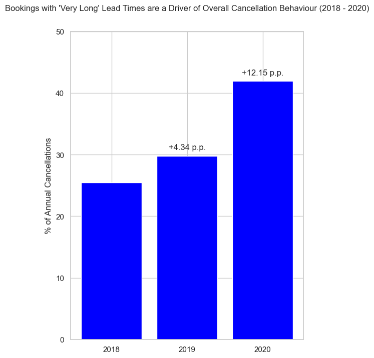
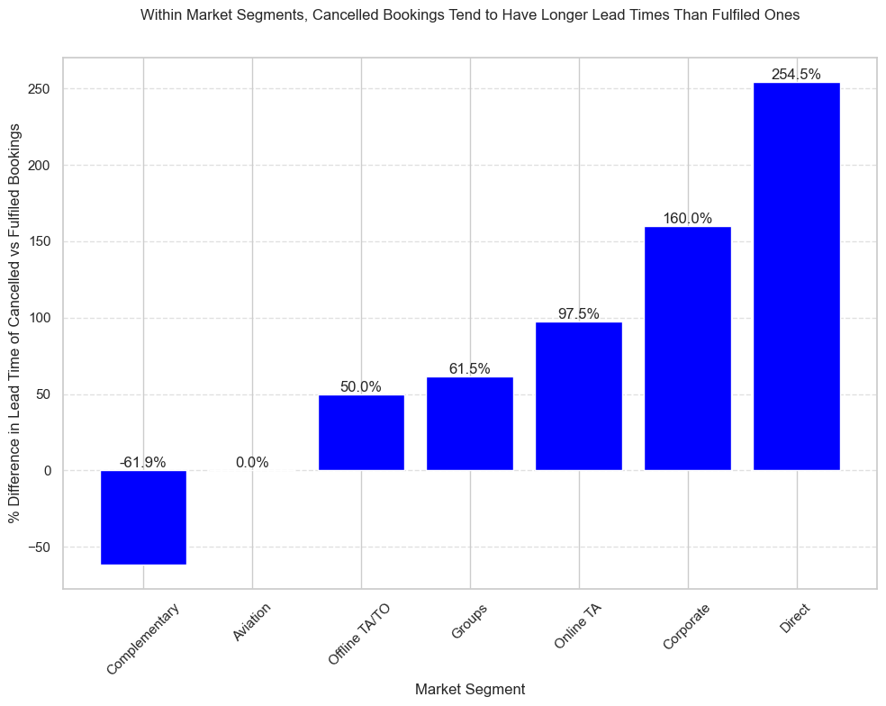
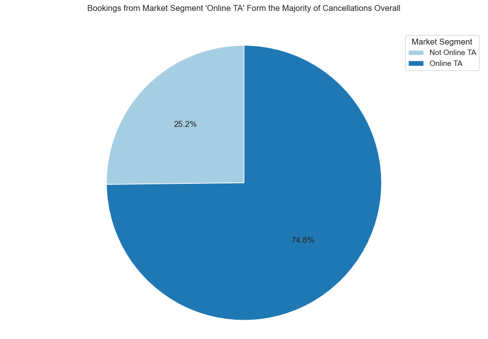
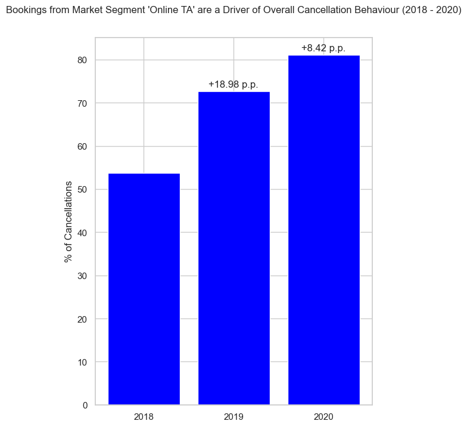
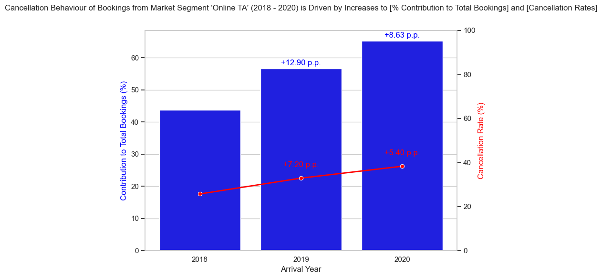

# Sources

Definitions and background:
https://www.sciencedirect.com/science/article/pii/S2352340918315191#s0005

Data 2018 - 2020:
https://absentdata.com/data-analysis/where-to-find-data/
Uploaded as "hotel_revenue_historical-full-2.csv"

Data 2015 - 2017:
https://github.com/rfordatascience/tidytuesday/blob/main/data/2020/2020-02-11/readme.md

# Brief

EDA which first reveals cancellation activity patterns, diagnoses drivers, and proposes relevant actions in accordance to navigate these findings.
This project therefore addresses hypothetical business questions like:
- "Are there particular channels/groups/etc. with increasing cancellation trends for which mitigation efforts should be focused on?"
- [To do: add revenue implications into analysis to add depth to above]
- "Why are our forecasting models for occupancy losing accuracy? / "Which types of bookings are more liable to cancel?"
- "What are the trends in customer cancellations?"

Overview of information of focus:
- Metric of interest: cancellations (be they originated by the customer or the hotel)
- Dimensions of interest: lead time. [To do: market segment (channel)]
- Date scope: 2015 - 2020 (entire dataset)
- Product scope: [to do: split by hotel type]
- Audience: operational managers (occupancy and staffing implications), data science leads (re: forecasting models), finance colleagues (revenue forecasting)
- Format: I envisage this as a relatively long-form story, as the problem statement is not superexplicit up-front. I.e. the EDA must within itself generate issues to pursue.
In this case, that cancellation behaviour in recent years is increasing.

**Outline of findings:**

1) Cancellation volume and rate are rising 'recently' 2018 - 2020.
2) (1) is driven mostly by bookings from 'Online TA' segment and bookings with longer lead times: these types of bookings make up a large proportion of cancellations.
3) (2) is intensifying over time: in the time period of interest, these two booking types are making up an increasing proportion of per-year cancellations.
4) (3) is an outcome of these types of bookings being popular in general (make up a large proportion of overall bookings), and have relatively high cancellation rates. Furthermore, both these aspects (popularity, propensity to cancel) are increasing in the time period of interest (with slight exceptions).
5) We observe too that the average lead time of bookings from Online TA is itself increasing, so these are not isolated booking patterns: bookings are 'worsening' on two joint fronts.

**Findings:**

1) Rising cancellation activity (volume and rate) in 'most recent' 3 years 2018 - 2020. This mirrors the rising cancellation activity previously seen in 2015 - 2017. For some reason the rising trend reversed dramatically in the time gap between these two periods, i.e. across 2017 - 2018
2) [To do: quantify YoY increases and 2020 YTD vs 2019 YTD]
3) [To do: quantify financial implications i.e. total potential $ value lost due to cancellations]
4) These cancellation trends are strongly driven by matching behaviour from the combination of bookings with 'Long' or 'Very Long' lead times
5) Specifically, it is the fluctuations in booking volumes of these lead time groups that causes the cancellation patterns seen. I.e. not changes to their cancellation rate (propensity).

**Recommendations:**
1) If not already factored in, definitely do acknowledge the relevance of Long / Very Long lead time bookings in occupancy/cancellation forecasting models
2) Based on volume, Long / Very Long lead time offerings are clearly an attractive proposition for customers, so do keep offering these / don't cancel them - think of less-obtrusive ways to keep cancellations under control.
3) E.g. lock-in prices at minor discounts or room upgrades provisional on non-refundable bookings; tuning up the loyalty rewards for seeing through bookings; creation of new 'partially (non-)refundable' deposits to introduce flexiblity, rather than being totally refundable or totally non-refundable.
4) Encourage booking completion through stronger post-booking engagement with the customer to retain their attention and commitment, e.g. trial or at least discuss possibility of more aggressive periodic reminders of bookings. May also use these as upselling and cross-selling opportunities whilst they wait for their big day.
   
# Housekeeping

**Assumptions made in structuring and cleaning the project:**

1) Assume SC meals (self-catered) have not had their price written in error, despite somehow costing more than full-board
2) Assume 'adr' (avg daily rate) is to be multiplied by nights stayed to find overall room rental revenue per booking, exclusive of meal costs
- See source: "Average Daily Rate as defined by dividing the sum of all _lodging_ transactions by the total number of staying nights"
3) Assume meals are applied to every non-baby guest in the same booking, for every day (nights + 1) spent, i.e. number of non-baby pax * price of meal package * nights spent = total meal cost to customer
4) Assume Null children --> 0 children
5) Assume bookings of zero pax are unsuable data
6) Assume bookings with zero adr (avg daily rate) yet which are not cancelled are unusable data
7) Take 'cancellations' - the main focus of this analysis - to be cancellations requested by the customer, i.e. in column "is_canceled", as opposed to cancellations which might also be originated from the hotel's side, i.e. in column "reservation_status"
8) The latest data up to September 2020 is 'recent', i.e. we are now in e.g. October 2020

# Detail

## Rising Cancellation Rate and Volume (per Period) 2015 - 2020

The trends at a year level of granularity show how the rising trend in cancellation behaviour is interrupted by a dramatic dip between 2017 and 2018:

<!--YYD Cancellations in 2020 Exceed Those of 2019:

-->

The same trends are largely observed at a year-season level of granularity, though less obviously so:

It emerges that both cancellation rate and cancellation volume are affected by both season and year independently:

## Bookings with Lengthy Lead Times are a Key Driver of Cancellation Behaviour Observed

Generally, when a period's (particular year-season e.g. 2018-Spring) normalised cancellation volume was high, so too was the proportion of these cancellations represented by bookings with lengthy lead times:

This is consistently true year by year / period by period, and is because of relatively higher booking volumes and cancellation rates from such bookings (no charts presented for these points).

Not only are bookings with lengthy lead times a major force for overall cancellations, but their influence is increasing, as their contribution to overall cancellation volumes increased 2018 - 2020:

The flucutations in booking volumes for these lengthy lead time bookings drives their fluctuating contributions to per-period cancellations:

The time-sensitive changes to cancellation rate of these lengthy lead time bookings is less clearly a driver of their changing contribution ot per-period cancellations:

Observe above that the two data lines aren't at all perfectly aligned in shape.
That said, holding season constant, e.g. 2018-Summer vs 2019-Summer,
cancellation rate does correspond to (% contribution towards) cancellation volumes.
E.g. each Summer, the proportion of cancellations represented by Long / Very Long increases, and so does their cancellation rate. In fact, this is true of every season-by-year. So there is a match in that limited sense.

**Reccomendations**
Consider that offering long booking lead times is a benefit to customers, seen in how they form the majority of bookings overall. So long as the offering of long lead-times brings in more revenue than it costs to 'host' bookings for such a long time, they are worthwhile and encouraged. As the cancellation rate is <50%, and it is hard to imagine there being too much monetary cost from offering and maanging lengthy lead-times, this should be true. But again, as per the earlier section in this readme file, consider quantifying this in monetary terms e.g. value of bookings cancelled vs completed for long lead time bookings.

The takeaways to be actioned are more around working around the cancellation tendencies of such bookings,
and trying to calm the rising trend therein, instead of discouraging the bookings entirely:
1) Calibrate overbooking strategy: use latest data on cancellation rate from these lead-time groups to make occupancy planning more robust
2) Likewise for revenue forecasting
3) Try reducing cancellation risk through e.g. slight discounts or lock-in prices or room upgrades for choosing non-refundable bookings, more aggressive reminders to confirm bookings, etc.

### Driver 2: Bookings from "Online TA" segment/channel

Market segments do have distinct effects on cancellation rate independent of lead time, seen in how certain segments have high cancellation rates but relatively low lead times, and vice versa (no visual provided).

However, it still must be acknowledged that lead time does affect within-segment cancellation rates as expected: longer --> higher cancellation likelihood:

Bookings from "Online TA" segment form the majority of overall cancellations:

This is consistently true year by year / period by period, and is because of relatively higher booking volumes and cancellation rates from such bookings (no charts presented for these points).

Not only are bookings from ONline TA segment a major force for overall cancellations, but their influence is increasing, as their contribution to overall cancellation volumes increased 2018 - 2020:

The increased influence of bookings with long lead times as above is driven both by increases in bookings made with such lead times, and in the cancellation rate of such bookings:

**Reccomendations**

The takeaways and insights for market segment analysis are quite similar to those of lead times,<
in that there is a prominent entity (online TA bookings, long lead-time bookings) which are rising in contribution to overall yearly cancellations,<
this itself a result of that entity increasing in contribution to overall yearly bookings, and having an increasing cancellation rate. 
Furthermore, they both represent 'modern' bookings perks which are attractive to customers (they are popular aspects of placing bookings),
and as of now, more bookings are fulfiled than not, so in neither case is it adviseable to steer away from them by offering only short-notice, offline (/ online but not TA) bookings.

The action points for the business are therefore similar:
1) Encourage customers to take on non-cancellable bookings even if using Online TA by locking in slightly lower prices if non-refundable, for instance.
2) Drill down into which specific Online TA are most culpable and plan bespoke mitigation strategies
3) Factor in a rising cancellation rate trend into overbooking systems if they exist

## Interaction (long) lead time vs (Online TA) segment

We see that average lead times within the Online TA segment have increased in the same pattern cancellation rates (within this segment and overall) changed over time, suggesting the former as an explanation for the latter.

To do: build chart for above and make recommendations/implications more specific if possible given this is the case.

